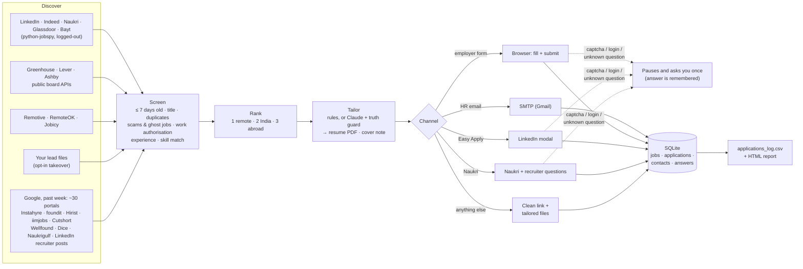

# Job Autopilot

Finds fresh DevOps / Cloud / SRE jobs on LinkedIn, Indeed, Naukri, company job boards and remote-job feeds. It screens them for freshness, genuineness and fit, and tailors your resume to each posting without inventing anything. Then it **applies directly**:

- by email when a recruiter published an address;
- by filling and submitting the employer's Greenhouse / Lever / Ashby form;
- through LinkedIn Easy Apply or Naukri (opt-in).

Every attempt is logged, and you get an HTML report with clean links for anything left to apply to by hand.

It lives next to your existing GitHub Actions mailers and never emails anyone they already contacted.

## One command

From the repo root:

```bash
python3 job_hunt.py --dry-run    # first time: everything except sending
python3 job_hunt.py              # daily: search, tailor, email HR / fill forms
python3 job_hunt.py --review     # the browser fills forms, you press Submit
python3 job_hunt.py --unattended # for cron: never stops to ask
```

`job_hunt.py` switches into `job_autopilot/.venv` by itself, runs `init` the first time, and then runs the whole pipeline.

**Where the inputs come from**

| What | File |
|---|---|
| Search keywords: the role titles used on every portal and in every Google query, rotated daily | `settings.yaml` → `search.keywords` |
| Title filters (must contain / must not contain) | `settings.yaml` → `search.title_include`, `search.title_exclude` |
| Skills matched against each posting | your resume, through the ~170-term vocabulary in `autopilot/text.py` |
| Your fixed details and form answers (name, phone, CTC, notice period, work authorisation, …) | `profile.yaml`, plus answers you typed once (`answers` command) |
| The email body | your own `bulk_mail_sender/template.html`, adapted to each job |
| Keys | `job_autopilot/.env` (Gmail, Gemini, Groq, OpenRouter). Google-search keys come from `job_lead_analyzer/.env`. |

**Every run gets its own folder**, named with the date and time it started in IST:

```
job_runs/2026-10-08_12-20-PM_IST/
  2026-10-08_12-20-PM_IST.xlsx   sheets: Summary · Jobs · HR Emails · Sent · Rejected
  2026-10-08_12-20-PM_IST.md     the same, readable at a glance
  jobs.csv  hr_emails.csv  sent.csv  rejected.csv  apply_manually.csv
  APPLY_MANUALLY/                new jobs the bot could not submit itself, best chance first
    README.md                    the list: link, why it needs you, which folder
    01-<company-role>/           tailored resume PDF, cover letter, email.txt to paste, APPLY.md
  applications/<company-role>/   what the bot sent: resume PDF, cover letter, the exact email (email.eml)
```

- **APPLY_MANUALLY** holds Naukri / LinkedIn / company-portal jobs that need your login. Each one is listed once: the first 20 get a tailored package (`apply.manual_max_per_run`), and the rest are listed as links. Forms the bot started but couldn't finish are listed here too, with the reason and a screenshot.
- **More jobs are applied automatically.** Some jobs are only "apply on company site" (LinkedIn) or a careers-page link. For those, the bot looks for the employer's own Greenhouse / Lever / Ashby form, either on the page itself or on the company's public board. A job is only switched over when the title **and** the location match (`apply.find_ats_forms`).
- Run folders older than 30 days keep their reports; their PDFs and emails are deleted (`paths.keep_files_days`).

- The **HR Emails** sheet lists every recruiter address found, including those on jobs that were skipped, with the reason for each (sent / already mailed by GitHub Actions / asks for 7+ years / …).
- The **Sent** sheet records where every application went, at what time, with which subject and file.
- `job_runs/` is git-ignored.

**Free LLMs instead of Claude.** Tailoring uses Gemini, then Groq, then OpenRouter. If a model is busy or rate-limited, the next one is used.

- Each job gets drafts from two providers. The truth guard scores both, and the draft it had to correct least wins.
- Sentence by sentence, the guard also checks that numbers come from one achievement: two bullets' metrics can't be welded into one claim.
- With no LLM reachable, the rule-based tailoring still runs.
- If `ANTHROPIC_API_KEY` is set, Claude is used instead (`tailoring.llm: auto`).

## AI search: more HR emails each run

`sources.ai_search` runs the search in rounds:

1. **Round 1** runs the planned Google searches (past week) across the portals, plus recruiter-post searches through OpenRouter's web search, which is strong on LinkedIn "share your resume at …" posts.
2. **After each round,** Gemini, Groq or OpenRouter (whichever answers) reads the posts that had an HR email and writes new search phrases in the same style. It varies titles, cities, "immediate joiner", "C2H", "3+ years" and so on.
3. **It stops** when a round finds no new HR email, or when the budget is spent: `max_rounds`, `web_searches` and `google_search.max_searches`.

**What is checked:**
- HR emails, companies and titles come **only from the post's own text**. Whatever an LLM says about a post is used only where those words are in the post.
- The LLM also flags training-course ads, job-seeker posts and multi-role lists, and they are dropped.
- LinkedIn posts are dated exactly from their post id. Anything older than this week is skipped.

**Cost:** each OpenRouter web search costs about $0.007 from your OpenRouter credit (15 a day is about $0.10) and uses one of the account's 50 free requests a day.

**The email** is short and built to get a reply:
- a role line;
- "What I bring for this role:" with three bullets, each pairing a requirement from the posting with one of your achievements (exact numbers);
- immediate joiner, resume attached, an invitation to a short call.

It's 70–150 words, and the subject reads "Application for <role> - <name> | 3 yrs DevOps & Cloud | Immediate".

## Every day by itself (GitHub Actions)

`.github/workflows/daily-job-autopilot.yml` runs the whole thing at **11:00 AM IST every day**. You can also start it yourself, either from **Actions → Daily Job Autopilot → Run workflow** (tick *dry_run* for a preview) or with `gh workflow run daily-job-autopilot.yml`.

- It emails every fitting HR address it found, up to `apply.email.max_per_run` (50), from your Gmail.
- It submits Greenhouse / Lever / Ashby forms.
- It **emails the report to you**: the Excel file, the summary, `APPLY_MANUALLY.zip` and the log.
- The repo is public, so nothing personal is committed, and the Actions page shows counts only.
- The "already emailed" history is kept in the Actions cache, so nobody is mailed twice.
- Every secret is optional: a missing one shows a warning and the run continues without that part. The secrets are listed at the top of the workflow file.

---

## 1. How it works



| Stage | What happens | Code |
|---|---|---|
| **Discover** | Each source runs on its own; a failing site is skipped. Searches are split about 40% remote, 35% India and 25% abroad. Keywords and cities rotate daily, so each run covers new combinations. | `discovery/` |
| **Freshness** | Postings older than `max_age_days` (7) are dropped. Undated posts are dropped unless the source already filtered by age. Jobs left in the queue are re-checked before each run. | `screening.py` |
| **Genuineness** | Drops scam wording (registration fees, "pay after placement", Telegram-only), closed LinkedIn postings and the same role re-posted for 60+ days (ghost job). It merges the same job seen on several boards and keeps the best route: employer form, then email, then Easy Apply, then a link. | `screening.py` |
| **Eligibility** | Remote roles must be open to India. "Remote – US only", "EMEA, LATAM, USA", a single foreign country or a security clearance all rule a job out. Roles abroad must be in your target hubs and must not say "no sponsorship". | `screening.py` |
| **Fit** | The experience range must allow your 3 years (+1 stretch). The match score is the weighted share of the posting's tech requirements your resume covers, out of about 170 DevOps/cloud terms with aliases (EKS ⇒ AWS + Kubernetes). | `screening.py`, `text.py` |
| **Tailor** | Bullets, skills and projects are re-ordered for the posting, and the summary and cover note are written from your own facts. With an Anthropic key, Claude rewrites them and the **truth guard** checks every sentence. | `tailoring/` |
| **Apply** | Email via SMTP, or a browser that fills forms label-by-label from your profile, your resume evidence and saved answers. | `apply/` |
| **Log** | Everything goes into `data/autopilot.db`. Each attempt is appended to `output/applications_log.csv` and summarised in `output/report_*.html`. | `db.py`, `reporting.py` |

### Truthfulness, enforced in code

Claude is instructed not to invent anything, and its output is also checked before use (`tailoring/guard.py`):

- A rewritten bullet may only mention technologies that **the same role's** bullets mention, and only numbers that **the same bullet** has.
  - EKS ⇒ AWS is allowed (an EKS bullet may say "AWS"); AWS ⇒ EKS is not.
  - Narrower terms need their own evidence: "Linux" in the resume does not license "RHEL".
- Acronyms and product names (CKA, SLOs, AZ-104, …) must already appear in your resume.
- No stated experience above `years_experience`, and no placeholders.
- Anything that fails reverts to your original bullet or the rule-based text. The reason is written to the job's `package.json`.
- Without a key, tailoring is rule-based. It only re-orders and quotes, so it is truthful by construction.
- Form answers are evidence-based too. "Years with Terraform?" comes from which roles mention it (≈1 year in your resume, vs Kubernetes ≈3), unless you override it in `skill_years`. "Experience with Snowflake?" answers **No**. Date of birth and ID numbers are never filled in.

---

## 2. Code structure

```
job_autopilot/
├── settings.yaml            # behaviour: keywords, filters, locations, sources, channels, caps
├── profile.example.yaml     # → profile.yaml (git-ignored): your details + standard answers
├── .env.example             # → .env (git-ignored): EMAIL_ADDRESS, EMAIL_PASSWORD, ANTHROPIC_API_KEY
├── autopilot/
│   ├── cli.py               # init · doctor · discover · apply · run · tailor · answers · status · report · login
│   ├── pipeline.py          # discover → screen → tailor → apply → log
│   ├── config.py  models.py  db.py  text.py  browser.py  reporting.py  screening.py
│   ├── discovery/
│   │   ├── boards.py            # LinkedIn / Indeed / Naukri / Glassdoor via python-jobspy
│   │   ├── linkedin_details.py  # public job page: full JD, Easy Apply vs external, closed?
│   │   ├── ats_boards.py        # Greenhouse / Lever / Ashby public APIs
│   │   ├── remote_feeds.py      # Remotive / RemoteOK / Jobicy
│   │   └── local_files.py       # your daily lead files (opt-in takeover)
│   ├── resume/
│   │   ├── parser.py            # PDF → data/master_resume.json (layout-aware)
│   │   ├── render.py            # HTML → PDF via headless Chromium (keeps it to 2 pages)
│   │   └── template.html.j2     # ATS-friendly one-column layout
│   ├── tailoring/
│   │   ├── __init__.py          # builds the package: resume PDF, cover letter PDF, email, package.json
│   │   ├── rules.py             # deterministic tailoring (and the fallback)
│   │   ├── llm.py               # Claude: structured output, prompt caching, refusal fallback
│   │   └── guard.py             # truthfulness checks
│   └── apply/
│       ├── __init__.py          # channel routing + "already contacted" registry
│       ├── email_channel.py     # SMTP with PDF attachment (+ .eml copy)
│       ├── answers.py           # form-question answering + Q&A cache
│       ├── forms.py             # generic label-driven Playwright form filler
│       └── portal.py            # Greenhouse/Lever/Ashby, LinkedIn Easy Apply, Naukri, login
└── tests/                   # 52 tests; fixtures replicate real Greenhouse/Lever/Ashby forms
```

---

## 3. Setup (about 10 minutes)

```bash
cd job_autopilot
uv venv --python 3.12 .venv                                   # or: python3.12 -m venv .venv
uv pip install --python .venv/bin/python -r requirements.txt  # or: .venv/bin/pip install -r requirements.txt
.venv/bin/python -m playwright install chromium               # renders the PDFs

cp .env.example .env          # EMAIL_ADDRESS + EMAIL_PASSWORD (a Gmail App Password); ANTHROPIC_API_KEY optional
.venv/bin/python -m autopilot init
```

`init` does three things:

1. Parses your resume PDF into `data/master_resume.json`.
2. Creates `profile.yaml` from it.
3. Prints what is still missing.

**Before the first real run:**

1. **Read `data/master_resume.json` once.** Every tailored resume is built from it, so fix anything the parser got wrong, or anything you want changed everywhere. The tool never edits facts on its own.
2. Fill in `current_ctc` and `expected_ctc` in `profile.yaml`. Check `notice_period` (`init` copied "Immediate" from your email template) and adjust `skill_years` if the evidence-based years undersell a skill.
3. Run the checks:

```bash
.venv/bin/python -m autopilot doctor --smtp --llm   # tests the Gmail login and the Anthropic key
.venv/bin/python -m autopilot run --dry-run         # everything except sending; inspect output/
.venv/bin/python -m autopilot run --review          # first real run: the bot fills forms, you press Submit
.venv/bin/python -m autopilot run                   # from then on: applies directly
```

### LinkedIn and Naukri (opt-in)

```bash
.venv/bin/python -m autopilot login linkedin    # sign in by hand in the bot's browser, once
.venv/bin/python -m autopilot login naukri
# then in settings.yaml:  apply: { channels: [email, ats, linkedin, naukri] }
```

> **Account risk.** LinkedIn's User Agreement forbids automation, and its help pages say accounts that use bots risk restriction. LinkedIn also enforces daily Easy Apply limits. Naukri rate-limits too.
>
> Both channels are therefore off by default, capped at 10 per run, paced like a person, and stop when the site reports a daily limit. Your password stays in your browser, never in this tool.
>
> Whether to use them is your call.

### Run it daily

Unattended runs never wait for you: a captcha or unknown question becomes `needs_attention` in the report.

```cron
# Weekdays 10:00, after the GitHub Actions mailers (09:23 IST). crontab -e
0 10 * * 1-5 cd /Users/saurabhagarwal/Desktop/JOB-Automation-Mail-/job_autopilot && .venv/bin/python -m autopilot run --unattended --headless --channels email,ats >> output/cron.log 2>&1
```

Then, when you have five minutes:

```bash
.venv/bin/python -m autopilot answers --pending   # questions forms asked that your profile couldn't answer
.venv/bin/python -m autopilot status
open output/report_*.html                          # "apply by hand" list with tailored files ready
```

---

## 4. Everyday commands

| Command | Does |
|---|---|
| `run [--dry-run] [--review] [--unattended] [--headless] [--channels …] [--max N]` | discover + apply |
| `discover` | find + screen only; prints the ranked queue |
| `apply …` | apply to the queue without searching again (same flags as `run`) |
| `tailor --top 5` | build packages for the top queued jobs, to review before sending |
| `answers` / `answers --pending` / `answers --set "Question=Answer"` / `answers --delete "Question"` | the Q&A cache |
| `status` | counts, skip reasons, latest applications |
| `report [--since 2026-10-01]` | HTML report + CSV export of everything |
| `doctor [--smtp] [--llm]` | setup checks |

`--dry-run` tailors and renders everything and saves each email as `email.eml`, but sends nothing and submits nothing. `--review` fills forms and leaves the Submit click to you.

---

## 5. Living next to the existing mailers

`bulk_mail_sender` and `job_lead_analyzer` keep running in GitHub Actions unchanged. Before emailing anyone, the autopilot reads:

- `bulk_mail_sender/mail_archive_7days/*.json` and today's `Pasted text(1).txt`
- `job_lead_analyzer/state.json`

It skips every address found there, so `doctor` reports 439 addresses that won't be re-mailed. It also never re-emails its own contacts within `recontact_after_days` (60).

**To send tailored mails to those lists instead of the generic template:**

1. Remove the generic send from the matching workflow first.
2. Then set `sources.pasted_jobs.enabled` or `sources.hr_email_leads.enabled` in `settings.yaml`.

Doing it in the other order mails the same recruiter twice.

---

## 6. Costs

The default setup is free:

- **Free models:** Gemini, Groq and OpenRouter free tiers (OpenRouter allows 50 free requests a day).
- **Google search:** spends `sources.google_search.max_searches` (12) credits per run from your SERP keys. The lead collector in GitHub Actions spends the same keys.

With `ANTHROPIC_API_KEY` set, each automatically submitted application costs one Claude call. The default model is `claude-opus-5-5` at $4 / $20 per million input / output tokens. Your resume is a cached prefix, so each call is billed mostly for the job description and the rewrite, roughly $0.05–0.10.

To spend less, any of these works:

- `tailoring.effort: low`
- `tailoring.model: claude-sonnet-5-5` (half the price)
- `tailoring.llm: none` (rule-based only)

Hand-off jobs use the free rule-based tailoring unless `tailoring.llm_for_manual: true`.

---

## 7. What has been verified, and what has not

| Verified | How |
|---|---|
| Discovery from LinkedIn, Indeed, Naukri, 44 ATS boards and 3 remote feeds | live runs on 2026-10-07: ~440 postings → ~49 kept after screening |
| Easy Apply vs external detection on LinkedIn job pages | live public pages |
| Field and label detection on real Greenhouse, Lever and Ashby forms | live, **read-only** scans (nothing typed or submitted) |
| Filling and submitting those forms, and a 4-step Easy Apply modal | local replicas of the same markup (`tests/fixtures`) |
| Email: MIME layout, PDF attachment, SMTP login + send | round-trip against a local SMTP server |
| Claude request shape, parsing, and the guard reverting invented metrics | stand-in client (`tests/test_llm.py`) |

**Not verified:**

- A live submission on any portal.
- LinkedIn Easy Apply and Naukri against the real sites (they need your login). The selectors come from bots maintained in Sep 2026.
- A real Gmail send or Claude call (no credentials were available).

`run --review` on a few jobs is the safe first test. Captchas (Greenhouse and Ashby use invisible reCAPTCHA, Lever uses hCaptcha) are handed to you rather than worked around.

---

## 8. Open-source projects worth knowing

All checked on GitHub on 2026-10-07. Mind the licences before copying code.

| Repo | Licence | Why |
|---|---|---|
| [speedyapply/JobSpy](https://github.com/speedyapply/JobSpy) | MIT | **Used here.** LinkedIn / Indeed / Naukri / Glassdoor scraping. `python-jobspy` 1.2.0, released 2026-10-02 with a fix for Naukri's new request token. |
| [GodsScion/Auto_job_applier_linkedIn](https://github.com/GodsScion/Auto_job_applier_linkedIn) | MIT | The best-maintained LinkedIn Easy Apply bot (Selenium). Ships DOM fixtures captured live in Sep 2026, so check it first when LinkedIn changes its markup. |
| [beatwad/LinkedIn-AI-Job-Applier-Ultimate](https://github.com/beatwad/LinkedIn-AI-Job-Applier-Ultimate) | MIT | Async Playwright applier for LinkedIn and Indeed. Handles LinkedIn's newer "SDUI" modal. |
| [career-ops-hq/career-ops](https://github.com/career-ops-hq/career-ops) | MIT | Scans Ashby / Greenhouse / Lever / Wellfound and auto-fills their forms (it never submits). |
| [navchandar/Naukri](https://github.com/navchandar/Naukri) | GPL-3.0 | Daily Naukri profile/resume refresh, which helps recruiter visibility. |
| [lordzohar/Naukri-autoapply-bot](https://github.com/lordzohar/Naukri-autoapply-bot) | none (all rights reserved) | Naukri apply + chatbot handling. Reference only. |
| [microsoft/playwright-python](https://github.com/microsoft/playwright-python) | Apache-2.0 | **Used here** for browsing and PDF rendering. |
| [browser-use/browser-use](https://github.com/browser-use/browser-use) · [Skyvern-AI/skyvern](https://github.com/Skyvern-AI/skyvern) | MIT · AGPL-3.0 | LLM-driven browser agents, for portals no selector can keep up with (Workday etc.). |

The once-popular AIHawk repo (`feder-cr/Jobs_Applier_AI_Agent_AIHawk`) now redirects to an unrelated project.

---

## 9. Troubleshooting

- **`email channel off: EMAIL_ADDRESS / EMAIL_PASSWORD are not set`**: fill in `.env`. Gmail needs an *App Password* (2-Step Verification must be on).
- **`LinkedIn page not read this run`**: there were more LinkedIn results than the page budget (`sources.linkedin.enrich_limit`), or LinkedIn rate-limited the run. Those jobs are retried on the next run.
- **Many `title not a DevOps/Cloud role`**: expected; the remote feeds return every category. Tune `search.title_include` / `title_exclude`.
- **A form keeps stopping on the same question**: answer it once with `answers --pending`, or `answers --set "Question text=Answer"`.
- **Resume changed**: run `init --reparse`. This replaces `data/master_resume.json`, so redo any manual edits.
- **Run tests**: `uv pip install --python .venv/bin/python -r requirements-dev.txt && .venv/bin/python -m pytest -q`
